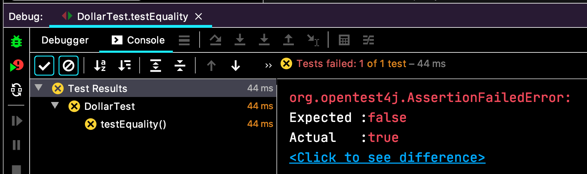
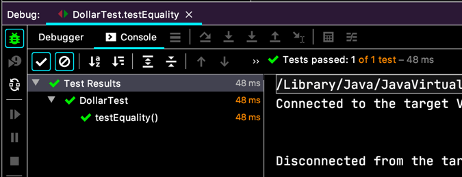

# 모두를 위한 평등

이전에 만든 `Dollar` 객체 같은 걸 **값 객체 패턴(Value Object Pattern)** 이라고 한대요.  
생성자 이후에 결코 변하지 않는 제약사항을 가진거죠.  

결국 변하지 않는 값을 가진것에 대한 동등성 비교가 필요한거죠.

> 5USD + 10CHF = 10USD (환율 2:1 적용)  
> ~~5USD * 2 = 10USD~~  
> amount 를 private 로 만들기  
> ~~Dollar 의 부작용 ?~~  
> Money 의 반올림 ?
> equals()
> hashCode()

새로운 대상을 즉시 할일에 추가해 줬어요. 그냥 외워서 알고 있는 내용인데, `equals()` 를 구현하기 위해서는 `hashCode()` 도 구현 해야한다고...  

```java
class DollarTest {
  @Test
  void testEquality() {
    assertTrue(new Dollar(5).equals(new Dollar(5)));
  } 
}
```

컴파일 오류는 없어요. `Object.equals()` 는 상속 받은 거니까.
하지만 빨간불. 스텁을 만들어야 겠죠.

```java
class Dollar {
  // ...

  public boolean equals(Object target) {
    return true;
  }
}
```
역시나 사악한 방법으로 스텁을 만들고 테스트를 통과해 보니,
$5 랑 $6 가 다르다는 비교도 해봐야 좀더 정확해 질 것 같아요.

```java
class DollarTest {
  @Test
  void testEquality() {
    assertTrue(new Dollar(5).equals(new Dollar(5)));
    assertFalse(new Dollar(5).equals(new Dollar(6)));
  } 
}
```
  
실패. 수습해봐요.
```java
class Dollar {
  // ...

  public boolean equals(Object object) {
    Dollar target = (Dollar) object;
    return amount == target.amount;
  }
}
```
  
수려하군요. 아름다워요.  
겸손하신 우리 백형이 소개한 삼각측량 측량법으로 `true`, `false` 테스트를 만들어서,


> 5USD + 10CHF = 10USD (환율 2:1 적용)  
> ~~5USD * 2 = 10USD~~  
> amount 를 private 로 만들기  
> ~~Dollar 의 부작용 ?~~  
> Money 의 반올림 ?
> ~~equals()~~
> hashCode()

이렇게 또 하나 선을 긋네요. 하지만 우리는 모두 알고 있어요.  
이건 훌륭하지 못한 결과라는걸.. `.equals(...)` 에 `null` 을 파라미터로 넘기면 NPE 가 나잖아...  
`amount` 는 아직도 public 이라니...  
그래도 일단 할일에 추가해놓고 보라니까 그리 해보죠.

> 5USD + 10CHF = 10USD (환율 2:1 적용)  
> ~~5USD * 2 = 10USD~~  
> amount 를 private 로 만들기  
> ~~Dollar 의 부작용 ?~~  
> Money 의 반올림 ?
> ~~equals()~~
> hashCode()
> Equal null
> Equal object
