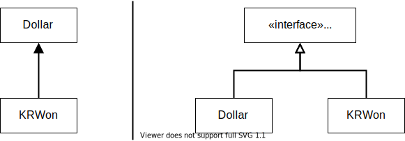

# 돌아온 "모두를 위한 평등"

> 5USD + 10CHF = 10USD (환율 2:1 적용)    
> ~~5USD * 2 = 10USD~~    
> **amount 를 private 로 만들기**    
> ~~Dollar 의 부작용 ?~~    
> Money 의 반올림 ?  
> ~~equals()~~  
> hashCode()    
> Equal null    
> Equal object    
> ~~5KRW * 2 = 10KRW~~   
> Dollar/Korea Won 중복  
> **공용 equals**  
> 공용 times  

깔끔하게 중복을 제거하는 방법 중 상속을 써봤는데, 백선생님께서는 건질게 없었다고 하셔요.  
대신 중복을 제거할 두 대상의 공통점을 찾아 상위 클래스를 만드는 합성을 사용하자고 해요.  
  
왼쪽 보다 오른쪽 처럼 하는 거죠.

```java
class Money {
  protected int amount;

  public boolean equals(Object target) {
    Money target = (Money) object;
    return amount == target.amount;
  }
}
```
`amount` 필드를 `protected` 로 만들어서 상속한 `Dollar`, `KRWon` 이 사용할 수 있게 했고, `equals(...)` 도 각각 따로 가지고 있던 걸 올려서 중복을 제거했어요.

`equals(...)` 내에 인스턴스 변수 이름을 `money` 로 바꿔요.  
**좀 더 원활한 의사소통을 위해서** 래요. (작은 것, 이름에도 신경을 쓰자! 이름 짓는 것도 설계의 일부다!!)

```java
class Money {
  protected int amount;

  public boolean equals(Object target) {
    Money money = (Money) object;
    return amount == money.amount;
  }
}
```

우와.. `KRWon` 객체애 대해서는 건드리지 말았어야 했네요.  
당연히 `Money` 객체를 만들어서 `Dollar` 와 `KRWon` 을 모두 상속시켜야 하는거라고 당연스레 생각했는데...  
저자가 하고 싶었던 이야기가 따로 있었네요.
**있으면 좋을 것 같은 테스트를 작성하라!**  
라고 해요. 그렇게 하지 않으면 결국 리팩토링하다가 뭔가 깨트릴 거라고...  
그러다가 점점...

1. 리팩토링에 안좋은 느낌을 가지게 되고,
2. 그러다보면 회사에서 짤리고,
3. 강아지마저 곁을 떠나고,
4. 우리 자신의 영양상태도 돌보지 못하고,
5. 그래서 치아가 나빠지고,
6. 그러다가 서글픈 결말.

그럴 순 없지!!

```java
  @Test
  public void testMultiplication4() {
    assertTrue(new Dollar(5).equals(new Dollar(5)));
    assertFalse(new Dollar(5).equals(new Dollar(6)));
    assertTrue(new KRWon(5).equals(new KRWon(5)));
    assertFalse(new KRWon(5).equals(new KRWon(6)));
  }
```
이렇게 다시 테스트를 만들어요. 물론 테스트가 깨지진 않지만.

`KRWon` 을 다시 고친다고 생각해봐요.

```java
class KRWon {
  private int amount; // 이젠 필요 없겠죠?

  // 이 equals(...) 도 Dollar 클래스에 있던거랑 비슷하니까...
  public boolean equals(Object target) {
    KRWon won = (KRWon) target;
    return amount == won.amount;
  }
}
```
`amount` 필드와 `equals(...)` 메서드를 제거할 수 있겠어요.

사실 한단계 한단계 실행해 나가야 하는데, 습관 때문인지 아니면, 오만함 때문인지 책 내용을 차근히 따라가지 못하고, 공용으로 `equals(...)` 를 먼저 상위로 올렸어요.  
아마도 TDD 에 아직 적응 못하고 있는 것 같네요.  
책에 좀 더 집중 해야겠어요...

그래도 어쨌든,

> 5USD + 10CHF = 10USD (환율 2:1 적용)    
> ~~5USD * 2 = 10USD~~    
> **amount 를 private 로 만들기**    
> ~~Dollar 의 부작용 ?~~    
> Money 의 반올림 ?  
> ~~equals()~~  
> hashCode()    
> Equal null    
> Equal object    
> ~~5KRW * 2 = 10KRW~~   
> Dollar/Korea Won 중복  
> ~~공용 equals~~  
> 공용 times  

