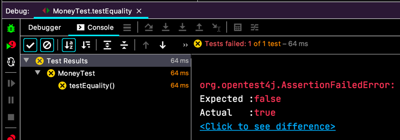
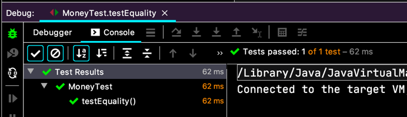

# 사과와 오렌지

> 5USD + 10CHF = 10USD (환율 2:1 적용)    
> ~~5USD * 2 = 10USD~~    
> ~~amount 를 private 로 만들기~~    
> ~~Dollar 의 부작용 ?~~    
> Money 의 반올림 ?  
> ~~equals()~~  
> hashCode()    
> Equal null    
> Equal object    
> ~~5KRW * 2 = 10KRW~~   
> Dollar/Korea Won 중복  
> ~~공용 equals~~  
> 공용 times  
>*KRWon 과 Dollar 비교하기
 
 
```java
class MoneyTest {
  @Test
  void testEquality() {
    assertTrue(new Dollar(5).equals(new Dollar(5)));
    assertFalse(new Dollar(5).equals(new Dollar(6)));
    assertTrue(new KRWon(5).equals(new KRWon(5)));
    assertFalse(new KRWon(5).equals(new KRWon(6)));
    assertFalse(new KRWon(5).equals(new Dollar(5)));
  }
}
```

  

`assertFalse(new KRWon(5).equals(new Dollar(5)))`
이게 실패했어요. 이유야 당연하죠.
`.equlas(...)` 를 고쳐야겠네요.

```java
class Money {
  // ...
  public boolean equals(Object object) {
    Money money = (Money) object;
    return amount == money.amount
        && getClass() == money.getClass();
  }
}
``` 
  
`getClass() == money.getClass()` 클래스까지 비교를 해줘서, 다시 통과!

> 5USD + 10CHF = 10USD (환율 2:1 적용)    
> ~~5USD * 2 = 10USD~~    
> ~~amount 를 private 로 만들기~~    
> ~~Dollar 의 부작용 ?~~    
> Money 의 반올림 ?  
> ~~equals()~~  
> hashCode()    
> Equal null    
> Equal object    
> ~~5KRW * 2 = 10KRW~~   
> Dollar/Korea Won 중복  
> ~~공용 equals~~  
> 공용 times  
> ~~KRWon 과 Dollar 비교하기~~  
> 통화?  
