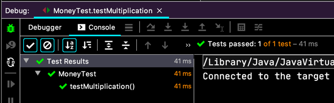
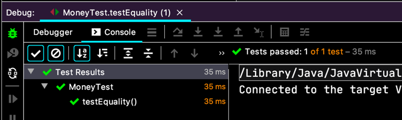
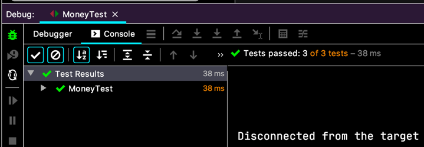

# 객체 만들기
> 5USD + 10CHF = 10USD (환율 2:1 적용)    
> ~~5USD * 2 = 10USD~~    
> ~~amount 를 private 로 만들기~~    
> ~~Dollar 의 부작용 ?~~    
> Money 의 반올림 ?  
> ~~equals()~~  
> hashCode()    
> Equal null    
> Equal object    
> ~~5KRW * 2 = 10KRW~~   
>*__Dollar/Korea Won 중복__  
> ~~공용 equals~~  
> 공용 times
> ~~KRWon 과 Dollar 비교하기~~
> 통화?

`Dollar` 랑 `KRWon` 이랑 `times()` 가 거의 똑같은데 좀더 비슷하게 만들기 만들어 보려고 해요.
반환 타입을 `Money` 로 할 수 있겠네요.
근데, 백선생님께서는 아예 Factory Method Pattern 을 말씀하시네요.

```java
class MoneyTest {
  
  @Test
  void testMultiplication() {
    Dollar five = Money.dollar(5);
    
    assertEquals(new Dollar(10), five.times(2));
    assertEquals(new Dollar(15), five.times(3));
  }

}
```
(또 깜빡했지 뭐에요. 팩토리 메서드 만들자고 하면서 Money 객체에 메서드를 만들려고 했어요... 이놈의 못된 버릇...)  

구현 코드는,
```java
class Money {
  // ...
  public static Dollar dollar(int amount) {
    return new Dollar(amount);
  }
  // ...
}
```
이렇게 해서,
  

이렇게 해놓고 보니 `Money` 클래스는 `times(...)` 메서드가 없네요. 추상 메서드로 만들면 더 좋은 설계가 될 것 같죠?

```java
public abstract class Money {
  // ...
  public abstract Money times(int multiplier);
  // ...
}
```
이렇게 바꿨으니까,
```java
class MoneyTest {
  // ...
  @Test
  void testEquality() {
    assertTrue(Money.dollar(5).equals(Money.dollar(5)));
    assertFalse(Money.dollar(5).equals(Money.dollar(6)));
    assertTrue(new KRWon(5).equals(new KRWon(5)));
    assertFalse(new KRWon(5).equals(new KRWon(6)));
    assertFalse(new KRWon(5).equals(Money.dollar(5)));
  }
}
```
이렇게 테스트를 바꾸고 실행~
  

팩토리 메서드 패턴을 적용해서 `Dollar` 클래스가 있다는 걸 감췄어요. `Money` 를 가져다 쓰는 클라이언트들은 슬쩍 보고선 하위에 `Dollar` 클래스가 있는지 모를거에요.
테스트에서 분리(decoupling) 해서 변경이 용이해졌어요.

`KRWon` 도 그렇게 바꿔봐요.

```java
class MoneyTest {
  // ...
  @Test
  void testKRWonMultiplication() {
    Money five = Money.won(5);
  
    assertEquals(new KRWon(10), five.times(2));
    assertEquals(new KRWon(15), five.times(3));
  }
}
```
먼저 테스트 작성.  
그리고 구현,
```java
class Money {
  // ...
  public static Money won(int amount) {
    return new KRWon(amount);
  }
  // ...
}
```

그리고 다시 테스트 실행하고, `testEquality()` 테스트도,
```java
class MoneyTest {
  // ...
  @Test
  void testEquality() {
    assertTrue(Money.dollar(5).equals(Money.dollar(5)));
    assertFalse(Money.dollar(5).equals(Money.dollar(6)));
    assertTrue(Money.won(5).equals(Money.won(5)));
    assertFalse(Money.won(5).equals(Money.won(6)));
    assertFalse(Money.won(5).equals(Money.dollar(5)));
  }
}
```

바꾼 `Money.won(...)` 팩토리 메서드로 바꿔서 실행.
  

> 5USD + 10CHF = 10USD (환율 2:1 적용)    
> ~~5USD * 2 = 10USD~~    
> ~~amount 를 private 로 만들기~~    
> ~~Dollar 의 부작용 ?~~    
> Money 의 반올림 ?  
> ~~equals()~~  
> hashCode()    
> Equal null    
> Equal object    
> ~~5KRW * 2 = 10KRW~~   
> Dollar/Korea Won 중복  
> ~~공용 equals~~  
> 공용 times
> ~~KRWon 과 Dollar 비교하기~~
> 통화?

아직, `times(...)` 를 하나로 통일하진 못했어요. 빨리 스트라이크를 긋고 싶어, 안달복달...
