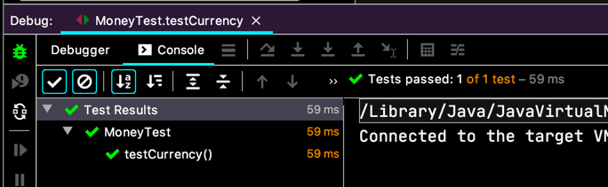

# 우리가 사는 시간
곱하기 `times` 로 언어유희에 맛들린 백선생님.

> 5USD + 10CHF = 10USD (환율 2:1 적용)    
> ~~5USD * 2 = 10USD~~    
> ~~amount 를 private 로 만들기~~    
> ~~Dollar 의 부작용 ?~~    
> Money 의 반올림 ?  
> ~~equals()~~  
> hashCode()    
> Equal null    
> Equal object    
> ~~5KRW * 2 = 10KRW~~   
> Dollar/Korea Won 중복  
> ~~공용 equals~~  
> 공용 times
> ~~KRWon 과 Dollar 비교하기~~
>*__통화?__  
> killing testKRWonMultiplication()

갑자기 **통화?** 테스트로 변경.  
뭐, 일단 따라가 봐요.

여러 통화에 대응하기 위해 복잡다양한 클래스를 만들기보단 그냥 가볍게 찍어내기를 하자시네요.

```java
class MoneyTest {
  // ...
  @Test
  void testCurrency() {
    assertEquals("USD", Money.dollar(1).currency());
    assertEquals("KRW", Money.won(1).currency());
  }
}
```
테스트를 만들고, 구현 클래스는,
```java
class Money {
  // ...
  public abstract String currency();
}

class Dollar extends Money {
  // ...
  
  @Override
  public String currency() {
    return "USD";
  }
}

class KRWon extends Money {
  // ...
  
  @Override
  public String currency() {
    return "KRW";
  }
}
```
이러고 테스트 실행. 성공~
  

리팩토링하는건... 굳이 안해도 될듯 하지만..
```java
public class Dollar extends Money {
  
  private String currency;
  
  public Dollar(int amount) {
    this.amount = amount;
    this.currency = "USD";
  }
  
  @Override
  public String currency() {
    return currency;
  }
  // ...
}

public class KRWon extends Money {
  
  private String currency;
  
  public KRWon(int amount) {
    this.amount = amount;
    this.currency = "KRW";
  }
  
  @Override
  public String currency() {
    return currency;
  }
  // ...
}
```
우와, 똑같네. 상위 클래스로 올리자. (이게 뭐람. 꼭 이렇게 해야하는 거겠지...)

```java
public abstract class Money {
  protected int amount;
  protected String currency;
  // ...
  public String currency() {
    return currency;
  }
  // ...
}

public class Dollar extends Money {  
  public Dollar(int amount) {
    this.amount = amount;
    this.currency = "USD";
  }
  // ...
}

public class KRWon extends Money { 
  public KRWon(int amount) {
    this.amount = amount;
    this.currency = "KRW";
  }
  // ...
}
```
같은 모양처럼 만들어야 합칠 수 있으니까,
```java
public class Dollar extends Money {  
  public Dollar(int amount, String currency) {
    this.amount = amount;
    this.currency = currency;
  }
  // ...
}

public class KRWon extends Money { 
  public KRWon(int amount, String currency) {
    this.amount = amount;
    this.currency = currency;
  }
  // ...
}
```


이렇게 하자니, 우리 만들었던 정적 팩토리 메서드는 어쩌죠?  
걔네도 고쳐야지. 백선생님도 짧게 중단하는 건 괜찮대요. 근데 한번 더 중단하는건 안된다고. (음... 이게 중요한건가..)

어쨌든 이제 똑같은 생성자가 생겼으니까,
```java
public abstract class Money {
  
  protected int amount;
  protected String currency;
  
  public Money(int amount, String currency) {
    this.amount = amount;
    this.currency = currency;
  }
  // ...
}

public class Dollar extends Money {
  public Dollar(int amount, String currency) {
    super(amount, currency);
  }
  // ...
}

public class KRWon extends Money {
  public KRWon(int amount, String currency) {
    super(amount, currency);
  }
  // ...
}
```


> 5USD + 10CHF = 10USD (환율 2:1 적용)    
> ~~5USD * 2 = 10USD~~    
> ~~amount 를 private 로 만들기~~    
> ~~Dollar 의 부작용 ?~~    
> Money 의 반올림 ?  
> ~~equals()~~  
> hashCode()    
> Equal null    
> Equal object    
> ~~5KRW * 2 = 10KRW~~   
> Dollar/Korea Won 중복  
> ~~공용 equals~~  
> 공용 times
> ~~KRWon 과 Dollar 비교하기~~
> ~~통화?~~  
> killing testKRWonMultiplication()
