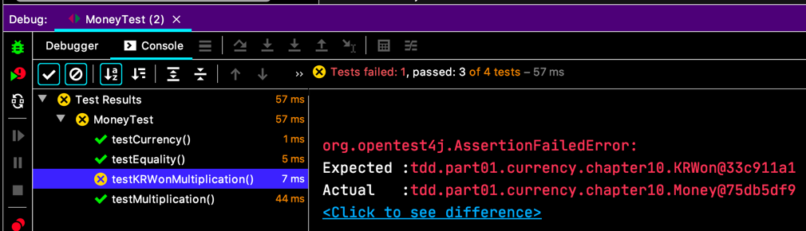
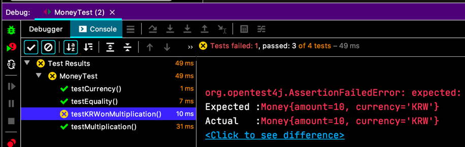
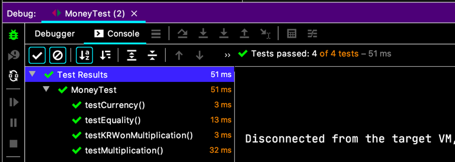
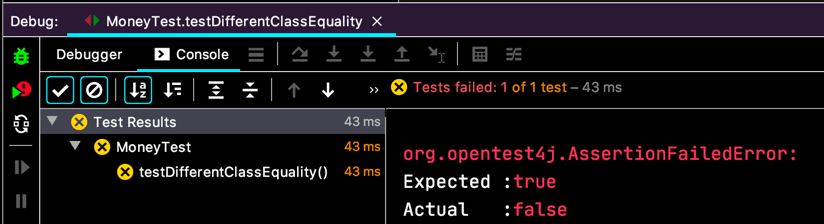
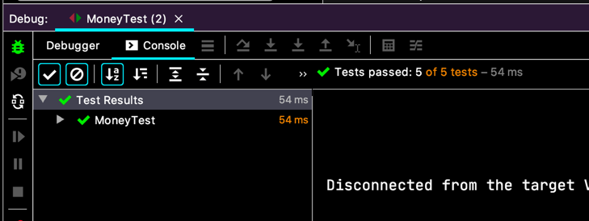
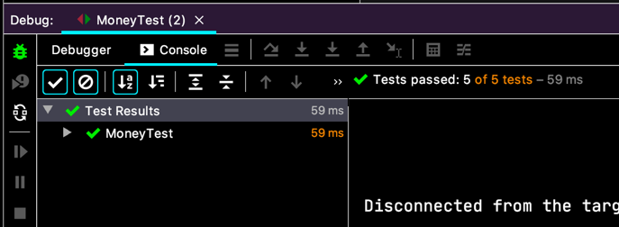

# 우리가 사는 시간
곱하기 `times` 로 언어유희에 맛들린 백선생님.

> 5USD + 10CHF = 10USD (환율 2:1 적용)    
> ~~5USD * 2 = 10USD~~    
> ~~amount 를 private 로 만들기~~    
> ~~Dollar 의 부작용 ?~~    
> Money 의 반올림 ?  
> ~~equals()~~  
> hashCode()    
> Equal null    
> Equal object    
> ~~5KRW * 2 = 10KRW~~   
> Dollar/Korea Won 중복  
> ~~공용 equals~~  
>*__공용 times__
> ~~KRWon 과 Dollar 비교하기~~
> ~~통화?~~  
> killing testKRWonMultiplication()

더이상 `Dollar` 랑 `KRWon` 을 동일하게 만들기 위한 방법이 없어 보이네요.
비슷하게 만들려면 아무래도 Method Factory Pattern 으로 객체를 만드는 걸 뒤집어야 할 것 같아요.

```java
public class Dollar extends Money {
  // ...  
  public Money times(int multiplier) {
    return new Dollar(amount * multiplier, currency);
  }
}

public class KRWon extends Money {
  // ...
  public Money times(int multiplier) {
    return new KRWon(amount * multiplier, currency);
  }
}
```
이래 놓고 나니까 어차피 `currency` 가 USD 이거나 KRW 를 나타내는데 굳이 클래스를 `Dollar` 이나 `KRWon` 을 쓸 필요 없을 것 같아요.
바꾸는게 딱히 어렵진 않은데 백선생님께서는 굉장히 조심스레 얘기하세요.

```java
public class Dollar extends Money {
  // ...  
  public Money times(int multiplier) {
    return new Money(amount * multiplier, currency);
  }
}

public class KRWon extends Money {
  // ...
  public Money times(int multiplier) {
    return new Money(amount * multiplier, currency);
  }
}
```
일단 원하는대로 코드를 바꿨더니 컴파일 오류가 나죠. 하지만  
똑같아졌어요. 이제 하나로 합치면 되겠네요. `Money` 로 `times(...)` 를 올려요!
메서드는 대충 Stub 으로 넘기죠, 사악하고 추악하고 악랄하지만...
```java
public /*abstrct*/ class Money {
  // ...
  public /*abstract*/ Money times(int multiplier) {
    return null;
  }
}
```
짜잔! 이제 다시 테스트... 하지만 실패 😱    
이게 뭐람.  
  

```java
public class Money {
  // ...
  @Override
  public String toString() {
    return "Money{" +
        "amount=" + amount +
        ", currency='" + currency + '\'' +
        '}';
  }
}
```
일단 메모리 참조된 값이 콘솔에 나오니까 `toString()` 구현하는데,... 아참! 테스트는 어쩌고?!
- 화면에 결과를 확인하려던 참이니까 (기능을 확인하는게 아니라 "결과")
- 어차피 `toString()` 은 출력에만 쓰이니까 저게 잘못될 가능성이 적고
- 이미 테스트 깨져서 빨간맛을 봤는데, 또다른 테스트는 만들지 않기로...

핑계거리가 많지만, 개개인의 의식수준에 맞춰서 요정도쯤은 예외를 해도 된다고 기준을 잡아주는 것 같아요.

  
한결 보기 편하지만 그래도 깨져서 붉게 물든 테스트여...  
눈물을 머금고, 우리의 원칙대로 다시 초록 막대로 되돌려요.

```java
class KRWon {
  // ...
  public Money times(int multiplier) {
    return new KRWon/*Money*/(amount * multiplier, currency);
  }
}
```
아름드리 푸르른 초록의 봄날이 온 것 같지만, 뭔가 씁쓸하다.
  

`KRwon(10, "KRW")` 이거랑 `Money(10, "KRW")` 이게 같길 바라는게 그렇게도 안될 일인가?!
> 포기는 없어~ 나를 믿고 해야 할 일을 해~~🎶
> - 안나, 겨울왕국2

저걸 테스트로 만드는 거에요!

```java
class MoneyTest {
  // ...
  @Test
  void testDifferentClassEquality() {
    assertTrue(
        new Money(10, "KRW")
            .equals(new KRWon(10, "KRW"))
      );
  }
}
```

  

아! 이제 알았어!!  
범인은 `equals(...)` 안에 있다! 


그래! **클래스 비교** 구문이었어!!! `currency` 가 `KRW` 랑 `USD` 로 쓰인다고, 같게 만들려고 `KRWon` 이랑 `Dollar` 를 `Money` 로 바꿨었잖아! 
그렇다면 `equals(...)` 는 클래스를 비교하지 말고, `currency` 를 비교했어야해!
```java
class MoneyTest {
  // ...
  @Override
  public boolean equals(Object object) {
    Money money = (Money) object;
    return amount == money.amount
        && currency().equals(money.currency());
  }
}
```

그래! 다시 되돌리고 테스트 해보자.
```java
class KRWon extends Money {
  // ...
  public Money times(int multiplier) {
    return new Money(amount * multiplier, currency);
  }
}
```
  

이젠 `Dollar` 도 바꾸는거야.
```java
class Dollar extends Money {
  // ...
  public Money times(int multiplier) {
    return new Money(amount * multiplier, currency);
  }
}
```
  

~~탐정놀이 끝.~~  
코드가 같아졌으니까 상위 클래스로 이동!

```java
class Money {
  // ...
  public Money times(int multiplier) {
    return new Money(amount * multiplier, currency);
  }
}
```
  


> 5USD + 10CHF = 10USD (환율 2:1 적용)    
> ~~5USD * 2 = 10USD~~    
> ~~amount 를 private 로 만들기~~    
> ~~Dollar 의 부작용 ?~~    
> Money 의 반올림 ?  
> ~~equals()~~  
> hashCode()    
> Equal null    
> Equal object    
> ~~5KRW * 2 = 10KRW~~   
> Dollar/Korea Won 중복  
> ~~공용 equals~~  
> ~~공용 times~~
> ~~KRWon 과 Dollar 비교하기~~
> ~~통화?~~  
> killing testKRWonMultiplication()

