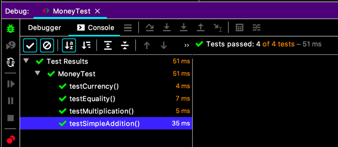
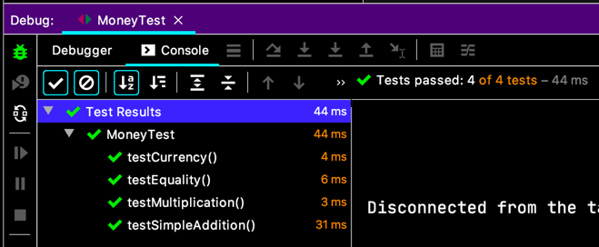

# 모든 악의 근원

우와! 꽤 진행했고 하니, 할일 목록도 정리를 해봐요.

> 5USD + 10CHF = 10USD (환율 2:1 적용)    
> ~~5USD * 2 = 10USD~~    
> ~~amount 를 private 로 만들기~~    
> ~~Dollar 의 부작용 ?~~    
> Money 의 반올림 ?  
> ~~equals()~~  
> hashCode()    
> Equal null    
> Equal object    
> ~~5KRW * 2 = 10KRW~~   
> ~~Dollar/Korea Won 중복~~  
> ~~공용 equals~~  
> ~~공용 times~~
> ~~KRWon 과 Dollar 비교하기~~
> ~~통화?~~  
> ~~killing testKRWonMultiplication()~~

이건 취향대로 하면 되는 거래요. 정리하던가 말던가...  
~~하지만 맹목적으로 책을 따라간다, 난 줏대없으니까~~

> 5USD + 10CHF = 10USD (환율 2:1)
>*__5USD + 5USD = 10USD__

더하기를 시작해 봐요.
```java
class MoneyTest {
  // ...
  @Test
  void testSimpleAddition() {
    Money sum = Money.dollar(5).plus(Money.dollar(5));
    assertEquals(Money.dollar(10), sum);
  }
}
```
`plus(...)` 컴파일 오류. 그래서 구현. (Stub 안 만드셨네...)
```java
class Money {
  // ...
  public Money plus(Money addend) {
    return new Money(amount + addend.amount, addend.currency());
  }
}
```
  
성공하지만 이건 다중 통화를 대응하기에 좀 부적절 하다고... (뭐가?? 내가 보기엔 훌륭한데...)  
어쨌든. 속도 조절을 잘 하라는 얘길 하고 싶으셨나보다. 빨리 달려야 할 때와 천천히 가야할 때가 있는 법이라 하니...

몇가지 아이디어를 말씀하시곤 산술 연산과 화폐를 동시에 표현할 수 있는 묘수로 Expression 을 얘기하시고, 단일 통화로 축약이 가능하다고 말씀하시는데... 사실 무슨 말인지 잘 모르겠어요.
일단 따라가 봐요.
```java
pulbic void testSimpleAddition() {
  ...
  assertEquals(Money.dollar(10), reduced);
}
```
축약된 것(reduced) 이라는 이름의 Expression 은 Expression 에 환율을 적용함으로써 얻어지는 거래요.  
그리곤 환율이 적용되는 곳은 은행이니까,
```java
pulbic void testSimpleAddition() {
  ...
  Money reduced = bank.reduce(sum, "USD");
  assertEquals(Money.dollar(10), reduced);
}
```
뭘까요? `bank` 등장의 의미는 ?

- Expression 은 우리가 하려는 일의 핵심이래요.  
  핵심이 되려는 객체는 가능한 다른 부분에 대해 몰라야 유연함을 오래 유지 할 수 있대요.  
  그리고 테스트가 쉽고, 재활용성있고, 이해하기 편하고.
- Expression 관련된 operation 이 많은 거라고 상상되고, 그걸 다 Expression 에만 추가하면 너무 커지니까.

`bank` 는 필요해요. 왜냐면... 그가 그렇게 말했으니까.

```java
pulbic void testSimpleAddition() {
  ...
  Bank bank = new Bank();
  Money reduced = bank.reduce(sum, "USD");
  assertEquals(Money.dollar(10), reduced);
}
```

자, 이제 두 `Money` 의 합은 `Expression` 이면 된대요.
```java
pulbic void testSimpleAddition() {
  ...
  Expression sum = five.plus(five);
  Bank bank = new Bank();
  Money reduced = bank.reduce(sum, "USD");
  assertEquals(Money.dollar(10), reduced);
}
```

5USD 도 간단히 만들어 주고.
```java
pulbic void testSimpleAddition() {
  Money five = Money.dollar(5); 
  Expression sum = five.plus(five);
  Bank bank = new Bank();
  Money reduced = bank.reduce(sum, "USD");
  assertEquals(Money.dollar(10), reduced);
}
```

음, 난리났네. 컴파일 오류. 하나씩 해봐요.  
`Expression` 은 인터페이스가 가벼우니까 그리 만들어주고.
```java
public interface Expression {
}
``` 

`plus(...)` 가 `Expression` 을 리턴하게 바꿔요.
```java
class Money {
  // ...
  public Expression plus(Money addend) {
    return new Money(amount + addend.amount, addend.currency());
  }
}
```
`Money` 는 `Expression` 을 구현해야지 되겠고요.  
`class Money implements Expression { ... }`

`Bank` 만들고요. `reduce(...)` 메서드도 있어야겠네요.
```java
public class Bank {
  public Money reduce(Expression sum, String usd) {
    return Money.dollar(10);
  }
}
```
`reduce(...)` 는 역시나 흉악하고 패악적으로다가 구현, 테스트 통과.
  


