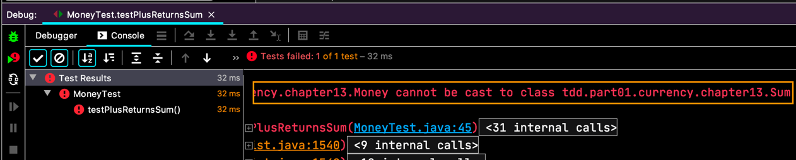
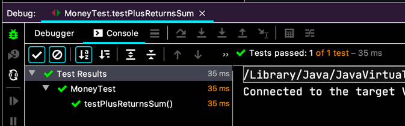
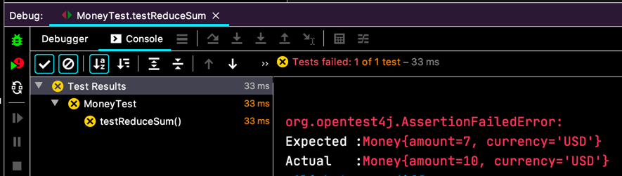
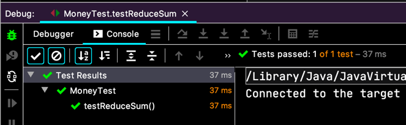
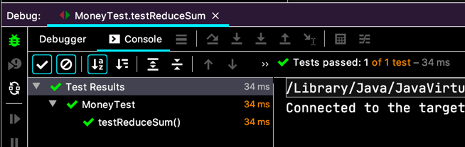
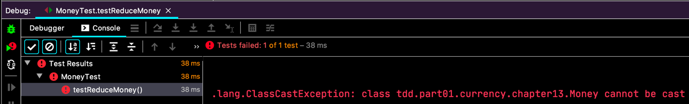
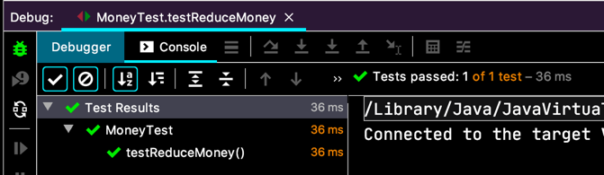
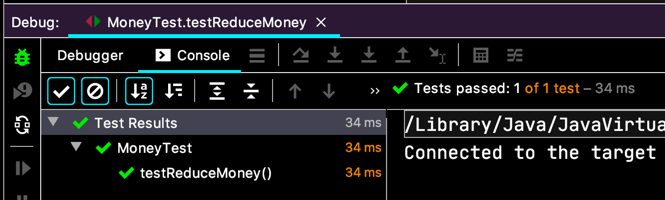

# 진짜로 만들기

- [ ] 5USD + 10KRW = 10USD(환율이 2:1)   
- [ ] **5USD + 5USD = 10USD**  

```java
class MoneyTest {
  // ...

  @Test
  void testPlusReturnsSum() {
    Money five = Money.dollar(5);
    Expression result = five.plus(five);
    Sum sum = (Sum) result;
    
    assertEquals(five, sum.augend);
    assertEquals(five, sum.addend);
  }
}
```
테스트 코드를 만들어요. 컴파일 오류 부터 해결하죠.
```java
class Sum {
  Money augend;
  Money addend;
}
```

이러면 일단 컴파일 에러는 없는 것 같아 실행 해 보면,  
  

`ClassCastException` 이네요.

```java
class Money {
  // ...

  public Expression plus(Money addend) {
    return new Sum(this, addend);
  }
}
```

이제 `Sum` 을 `implements Expression` 해줘야 겠네요.  
  

이제 `Bank.reduce(...)` 은 `Sum` 을 전달 받아요.  
`Sum` 이 가진 `Money` 들의 통화가 같고 `Bank.reduce(...)` 로 얻어낼 `Money` 의 통화도 같은 거라면, 결과는 `Sum` 내에 있는 `Money.acount` 들의 합과 같은 `Money` 객체가 나오면 되겠네요.

```java
class MoneyTest {
  // ...

  @Test
  void testReduceSum() {
    Expression sum = new Sum(Money.dollar(3), Money.dollar(4));
    Bank bank = new Bank();
    Money result = bank.reduce(sum, "USD");

    assertEquals(Money.dollar(7), result);
  }
}
``` 
  

왜 깨지나 싶었더니, 악랄하게 대충 구현한 `Bank.reduce(...)` 때문이네요.  
고쳐야겠죠.
```java
class Bank {
  public Money reduce(Expression source, String to) {
    Sum sum = (Sum) source;
    int amount = sum.augend.amount + sum.addend.amount;
    
    return new Money(amount, to);
  }
}
```
  

가까스로 성공했는데,
- Casting 이 맘에 안들고,
- public 필드와 객체 그래프 탐색이 2 depth 들어가서 지저분하다고...

간단히 리팩토링 해보면,

```java
public class Bank {
  public Money reduce(Expression source, String to) {
    Sum sum = (Sum) source;
    return sum.reduce(to);
  }
}

class Sum implements Expression {
  // ...

  public Money reduce(String to) {
    final int amount = augend.amount + addend.amount;
    return new Money(amount, to);
  }
}
```
리팩토링 간단히 했으니까, 테스트 실행.
  

- [ ] 5USD + 10KRW = 10USD(환율이 2:1)   
- [ ] 5USD + 5USD = 10USD  
  - [-] **5USD + 5USD 에서 Money 반환하기**  
  - [ ] Bank.reduce(Money)  

`Bank.reduce(...)` 에다가 `Money` 를 넘기는 걸 어떡할지 확인하려고 테스트 하나 더 만들었대요.  

```java
class MoneyTest {
  // ...

  @Test
  void testReduceMoney() {
    Bank bank = new Bank();
    Money result = bank.reduce(Money.dollar(1), "USD");
    
    assertEquals(Money.dollar(1), result);
  }
}
```
  

이번엔 예상했지.
```java
public class Bank {
  public Money reduce(Expression source, String to) {
    if (source instanceof Money) {
      return (Money) source;
    }

    Sum sum = (Sum) source;
    return sum.reduce(to);
  }
}
```
일단 이렇게,
  
테스트는 통과했지만, 지저분 하네요. 이럴때는 다형성을 사용하는게 좋아요.

```java
public interface Expression {
  Money reduce(String to);
}

public class Money implements Expression {
  // ...

  @Override
  public Money reduce(String to) {
    return this;
  }
}

public class Bank {
  public Money reduce(Expression source, String to) {
    return source.reduce(to);
  }
}
```
깔끔하게 정리 됐네요. 리팩토링 후 다시 테스트 실행, 잊지말고요.
  

책에서 동명의 메서드가 파라미터의 형이 다른것을 표현하는게 맘에 안든다고 하네요.  
~~IntelliJ 가 알아서 해주니까 이 문제는 패쓰~~

- [ ] 5USD + 10KRW = 10USD(환율이 2:1)   
- [ ] 5USD + 5USD = 10USD  
  - [ ] 5USD + 5USD 에서 Money 반환하기  
  - [X] Bank.reduce(Money)
  - [ ] Money 에 대한 통화 변환을 수행하는 Reduce
  - [ ] Reduce(Bank, String)      
