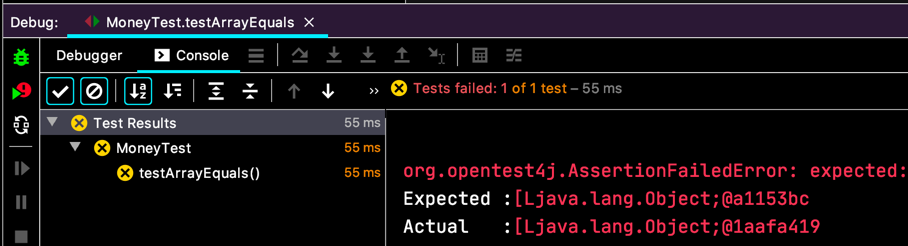
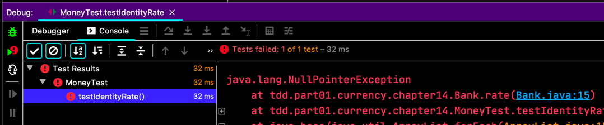

# 바꾸기
- [ ] 5USD + 10KRW = 10USD(환율이 2:1)   
- [ ] 5USD + 5USD = 10USD  
  - [ ] 5USD + 5USD 에서 Money 반환하기  
  - [X] Bank.reduce(Money)
  - [ ] **Money 에 대한 통화 변환을 수행하는 Reduce**
  - [ ] Reduce(Bank, String)      

2원이 있는데, 이걸 딸라로 바꾸고 싶으면...  
테스트가 필요하죠.
```java
class MoneyTest {
  // ...

  @Test
  void testReduceMoneyDifferentCurrency() {
    Bank bank = new Bank();
    bank.addRate("KRW", "USD", 2);
    Money result = bank.reduce(Money.won(2), "USD");
    
    assertEquals(Money.dollar(1), result);
  }
}
```

`bank.addRate(...)` 새로운게 생겼어요. 근데 일단 모른척하고 넘어가요.  
`bank.addRate("KRW", "USD", 2)` 이게 환율이 2배라는 얘긴가봐요. 환율을 계산해보죠.
```java
class Money implements Expression {
  // ...

  @Override
  public Money reduce(String to) {
    int rate = (currency.equals("KRW") && to.equals("USD")) ? 2 : 1;
    return new Money(amount / rate, to);
  }
}
``` 
저는 별로 거부감 없는데, 백선생님은 `Money` 가 환율을 알게된게 많이 불편하신가봐요. 토하셨어요.  
환율은 `Bank` 만 알아야 깔끔하긴 하겠지...  
그래서 `Expression.reduce(...)` 에 `Bank` 를 넘겨줘야 겠어요.
```java
public interface Expression {
  Money reduce(Bank bank, String to);
}

class Sum implements Expression {
  // ...

  @Override
  public Money reduce(Bank bank, String to) {
    final int amount = augend.amount + addend.amount;
    return new Money(amount, to);
  }
}

class Money implements Expression {
  // ...

  @Override
  public Money reduce(Bank bank, String to) {
    int rate = (currency.equals("KRW") && to.equals("USD")) ? 2 : 1;
    return new Money(amount / rate, to);
  }
}
```
이러고 나니까 그다음 `Bank` 가 환율을 다룰 수 있게 됐네요.
```java
class Bank {
  // ... 

  int rate(String from, String to) {
    return from.equals("KRW") && to.equals("USD")
        ? 2
        : 1;
  }
}

class Money implements Expression {
  // ...

  @Override
  public Money reduce(Bank bank, String to) {
    int rate = bank.rate(currency, to);
    return new Money(amount / rate, to);
  }
}
```
이제 환율은 `bank.rate(...)` 에게서 얻으면 되겠어요.

근데, 상수 `2` 가 박혀 있는게 또 거슬리네요. 통화 환율을 여러개 다룰 수 있도록 해볼까요?
환율을 담는 `Map` 을 쓸 때 키로 두 통화의 배열을 넣고 싶으니까...
```java
class MoneyTest {
  // ...

  @Test
  void testArrayEquals() {
    final Object[] tests = {"test"};
    assertEquals(tests, new Object[] {"test"});
  }
}
```
원래는 [REPL](https://ko.wikipedia.org/wiki/REPL) 을 쓰겠지만, 책에서는 이것도 테스트 메서드를 하나 만들었네요.
  
실패. 다른방법을 써야겠네요. 키로 쓸 객체가 필요해요.

```java
class Pair {
  private final String form;
  private final String to;
  
  public Pair(String form, String to) {
    this.form = form;
    this.to = to;
  }
}
```
이렇게 만들고, `HashTable` 의 `key` 로 사용할 객체니까 `equals(...)` 랑 `hashCode()` 를 구현 해줘야 하는데...  
지금은 속도를 높이고 있고, 리팩토링 중이니까 고런것쯤은 넘기는 걸로.  
(게다가 그냥 IDE 로 제네레이션 하니까 굳이 테스트는 필요 없을지도...)

```java
class Pair {
  // ...

  @Override
  public boolean equals(Object o) {
    if (this == o) {
      return true;
    }
    if (o == null || getClass() != o.getClass()) {
      return false;
    }
    Pair pair = (Pair) o;
    return Objects.equals(form, pair.form) &&
        Objects.equals(to, pair.to);
  }
  
  @Override
  public int hashCode() {
    return Objects.hash(form, to);
  }
}
``` 

환율을 저장하는 걸 만들고, 그리고 기존에 환율을 꺼내는 `rate(...)` 도 고쳐줘요.
```java
public class Bank {
  private Map<Pair, Integer> rates = new HashMap<>();

  // ...

  int rate(String from, String to) {
    return rates.get(new Pair(from, to));
  }

  void addRate(String from, String to, int rate) {
    rates.put(new Pair(from, to), rate);
  }
}
```
그래서 환율관련한 테스트를 하나 해보면,
```java
class MoneyTest {
  // ...

    @Test
    void testIdentityRate() {
      assertEquals(1, new Bank().rate("USD", "USD"));
    }
}
```
  
음... 당연한건데... 이걸 이렇게 처리해요.

```java
class Bank {
  // ...
  int rate(String from, String to) {
    if (Objects.equals(from, to)) {
      return 1;
    }
    
    return rates.get(new Pair(from, to));
  }
}
```
같은 통화는 환율이 1 인거죠.
테스트를 다시 실행하면 당연히 통과.

- [ ] 5USD + 10KRW = 10USD(환율이 2:1)   
- [ ] 5USD + 5USD = 10USD  
  - [ ] 5USD + 5USD 에서 Money 반환하기  
  - [X] Bank.reduce(Money)
  - [X] **Money 에 대한 통화 변환을 수행하는 Reduce**
  - [X] Reduce(Bank, String)      

