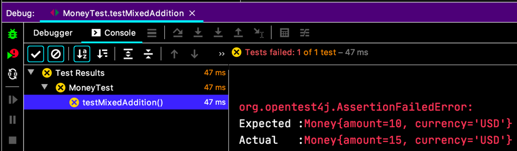
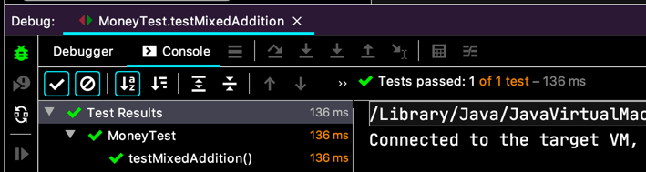
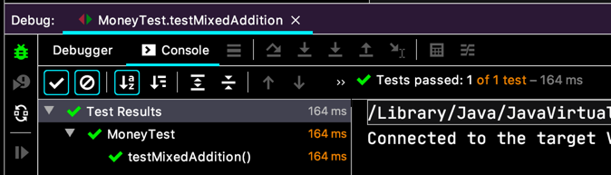
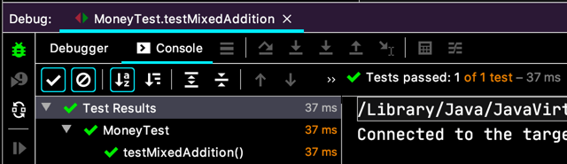

# 서로 다른 통화 더하기

- [ ] **5USD + 10KRW = 10USD(환율이 2:1)**   
- [X] 5USD + 5USD = 10USD  
  - [ ] 5USD + 5USD 에서 Money 반환하기  
  - [X] Bank.reduce(Money)
  - [X] Money 에 대한 통화 변환을 수행하는 Reduce
  - [X] Reduce(Bank, String)      

바로 들어가요.
```java
class MoneyTest {
  // ...

  @Test
  void testMixedAddition() {
    Expression fiveBucks = Money.dollar(5);
    Expression tenKoreaWons = Money.won(10);
    
    Bank bank = new Bank();
    bank.addRate("KRW", "USD", 2);
    
    Money result = bank.reduce(fiveBucks.plus(tenKoreaWons), "USD");
    
    assertEquals(Money.dollar(10), result);
  }
}
```
컴파일 에러.  
`Expression` 은 `plus(...)` 를 가지고 있질 않아요. `Money` 로 바꾸고 실행.  
  

```java
class Sum implements Expression {
  // ...
  @Override
  public Money reduce(Bank bank, String to) {
    final int amount = augend.reduce(bank, to).amount
        + addend.reduce(bank, to).amount;
    return new Money(amount, to);
  }
}
```
이렇게 고치면..  
  

이제 `Expression` 이어야 하는 `Money` 들을 없애봐요.

```java
class Sum implements Expression {
  Expression augend;
  Expression addend;
  
  public Sum(final Expression augend, final Expression addend) {
    this.augend = augend;
    this.addend = addend;
  }

  // ...
}

class Money implements Expression {
  // ...

  public Expression times(int multiplier) {
    return new Money(amount * multiplier, currency);
  }

  public Expression plus(Expression addend) {
    return new Sum(this, addend);
  }

}
```
그러면 테스트의 `Money.plus(...)` 의 argument 가 컴파일 에러 나는 건 처리 할 수 있겠네요.
```java
class MoneyTest {
  // ...
  @Test
  void testMixedAddition() {
    Money fiveBucks = Money.dollar(5);
    Expression tenKoreaWons = Money.won(10);
    
    Bank bank = new Bank();
    bank.addRate("KRW", "USD", 2);
    
    Money result = bank.reduce(fiveBucks.plus(tenKoreaWons), "USD");
    
    assertEquals(Money.dollar(10), result);
  }
}
```
  

이젠 `Money.plus(...)` 도 바꿔봐요.
```java
interface Expression {
  // ...
  Expression plus(Expression addend);
}
```
이러면, 구현을 해달라고 컴파일 에러. 그래서 처리 해요.
```java
class Sum implements Expression {
  // ...

  @Override
  public Expression plus(Expression addend) {
    return null;
  }
}
```
  

그리고 Stub 으로 만든 사악한 `Expression.plus(...)` 는 할일 목록에 넣어요.

- [X] **5USD + 10KRW = 10USD(환율이 2:1)**
- [X] 5USD + 5USD = 10USD  
  - [ ] 5USD + 5USD 에서 Money 반환하기  
  - [X] Bank.reduce(Money)
  - [X] Money 에 대한 통화 변환을 수행하는 Reduce
  - [X] Reduce(Bank, String)  
- [ ] Sum.plus   
- [ ] Expression.times   
