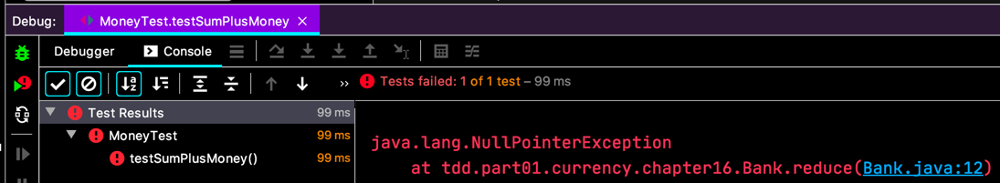
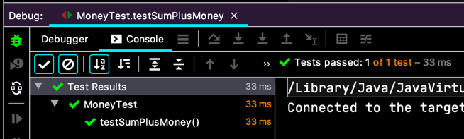
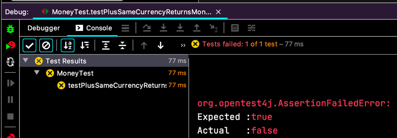

# 드디어, 추상화
- [X] 5USD + 10KRW = 10USD(환율이 2:1)
- [X] 5USD + 5USD = 10USD  
  - [ ] 5USD + 5USD 에서 Money 반환하기  
  - [X] Bank.reduce(Money)
  - [X] Money 에 대한 통화 변환을 수행하는 Reduce
  - [X] Reduce(Bank, String)  
- [ ] **Sum.plus**   
- [ ] Expression.times

추가된 할일을 해봐요.
```java
class MoneyTest {
  // ...
  @Test
  void testSumPlusMoney() {
    Expression fiveBucks = Money.dollar(5);
    Expression tenKoreaWons = Money.won(10);
    
    Bank bank = new Bank();
    bank.addRate("KRW", "USD", 2);
    
    Expression sum = new Sum(fiveBucks, tenKoreaWons)
        .plus(fiveBucks);
    
    Money result = bank.reduce(sum, "USD");
    
    assertEquals(Money.dollar(15), result);
  }
}
```
  
구현도 안하고선...
```java
class Sum implements Expression {
  // ...

  @Override
  public Expression plus(Expression addend) {
    return new Sum(this, addend);
  }
}
```

- [X] 5USD + 10KRW = 10USD(환율이 2:1)
- [X] 5USD + 5USD = 10USD  
  - [ ] 5USD + 5USD 에서 Money 반환하기  
  - [X] Bank.reduce(Money)
  - [X] Money 에 대한 통화 변환을 수행하는 Reduce
  - [X] Reduce(Bank, String)  
- [X] Sum.plus
- [ ] **Expression.times**

```java
class Sum implements Expression {
  // ...
  public Expression times(int multiplier) {
    return new Sum(
        augend.times(multiplier),
        addend.times(multiplier)
    );
  }
}
```
당연히 컴파일 에러. 그래서,
```java
interface Expression {
  // ...
  Expression times(int multiplier);
}
```
  

- [X] 5USD + 10KRW = 10USD(환율이 2:1)
- [X] 5USD + 5USD = 10USD  
  - [ ] **5USD + 5USD 에서 Money 반환하기**  
  - [X] Bank.reduce(Money)
  - [X] Money 에 대한 통화 변환을 수행하는 Reduce
  - [X] Reduce(Bank, String)  
- [X] Sum.plus
- [X] Expression.times

마지막 할일.
```java
class MoneyTest {
  // ...
  @Test
  void testPlusSameCurrencyReturnsMoney() {
    Expression sum = Money.dollar(1).plus(Money.dollar(1));
    
    assertTrue(sum instanceof Money);
  }
}
```
  

이런 테스트는 왜 했을까요?;;
- [X] 5USD + 10KRW = 10USD(환율이 2:1)
- [X] 5USD + 5USD = 10USD  
  - [X] 5USD + 5USD 에서 Money 반환하기  
  - [X] Bank.reduce(Money)
  - [X] Money 에 대한 통화 변환을 수행하는 Reduce
  - [X] Reduce(Bank, String)  
- [X] Sum.plus
- [X] Expression.times
