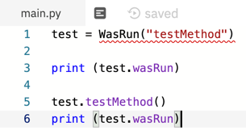
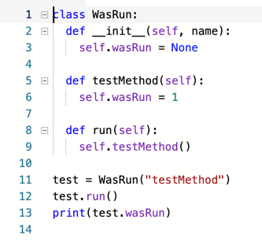
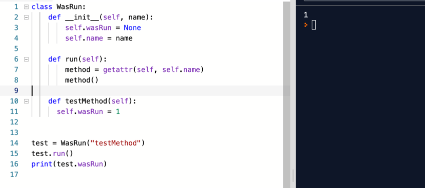
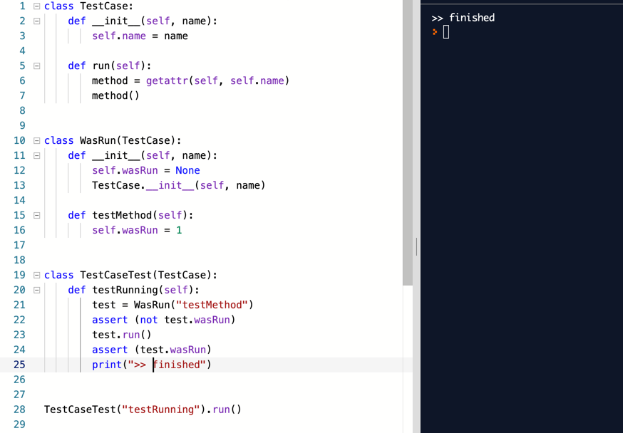

# xUnit 으로 가는 첫걸음
테스트 툴을 만드는 과정에서 TDD 로 한다는게 기발한 아이디어 인 것 같아요.  
이것도 역시나 할일 목록을 정해서 진행해봐요.

- [ ] **테스트 메서드 호출하기**
- [ ] 먼저 setUp 호출하기
- [ ] 나중에 tearDown 호출하기
- [ ] 테스트 메서드가 실패하더라도 tearDown 호출하기
- [ ] 여러 개의 테스트 실행하기
- [ ] 수집된 결과를 출력하기

이름은 `WasRun` 으로 정하고 시작하네요.
깐  

역시나 테스트를 먼저 작성하죠. 당연히 컴파일.. 아, 아니. 파이썬은 인터프린터라고 해야하나요?
암튼, 오류.

음.. `WasRun` 을 `pass` 이런것도 있네요. 신기한 언얼세...  
일단은 따라가 봐요.

뭘 하려는 건지 모르겠고, 책의 예제와는 다른 버전의 파이썬을 쓰고 있어서 맞게 하는 건지...   

희한한 패턴이네요. `getattr(...)` 은 java 에서 `reflection` 같은 건가 보네요.  
  

유사분열을 일으킬 시기라는데, 뭐가 유사 분열인지...  
`TestCase` 라는 class 를 만들어요.

이렇게 하면 되는걸까요?

- [X] **테스트 메서드 호출하기**
- [ ] 먼저 setUp 호출하기
- [ ] 나중에 tearDown 호출하기
- [ ] 테스트 메서드가 실패하더라도 tearDown 호출하기
- [ ] 여러 개의 테스트 실행하기
- [ ] 수집된 결과를 출력하기
