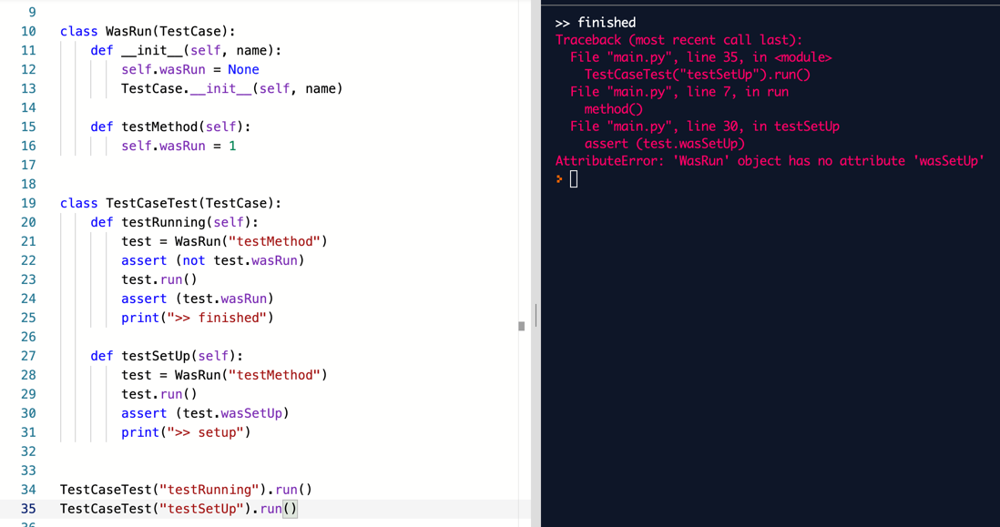
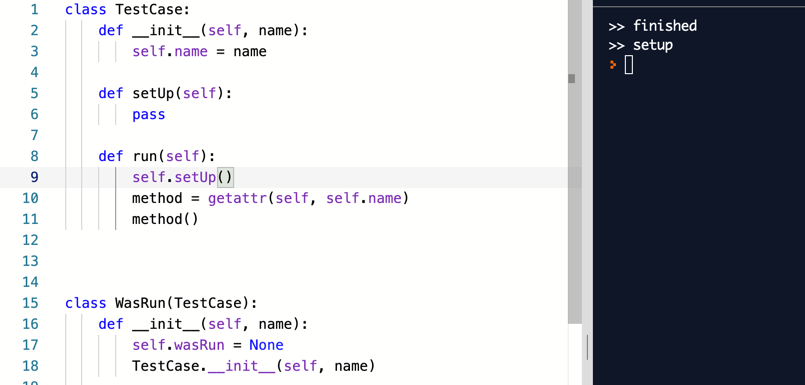
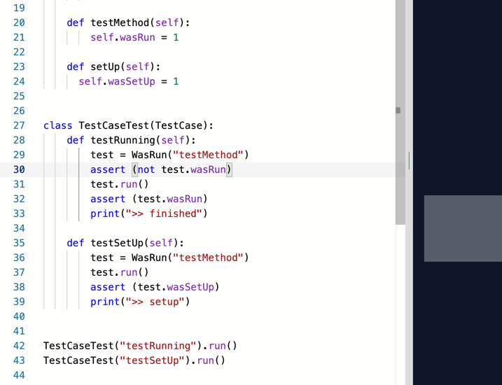
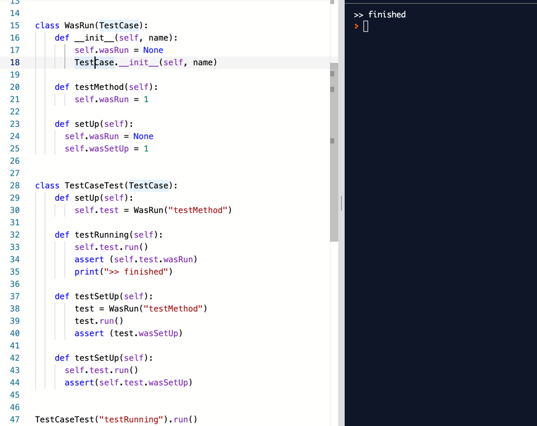

# 테이블 차리기

테스트를 작성하다 보면 공통된 패턴을 발견한다는데,
 1. 준비(arrange) - 객체를 생성하고
 2. 행동(act) - 어떤 자극을 주고
 3. 확인(assert) - 결과를 검사
 
아직 확~ 와닿는 얘긴 아닌것 같네요.

- [X] 테스트 메서드 호출하기
- [ ] **먼저 setUp 호출하기**
- [ ] 나중에 tearDown 호출하기
- [ ] 테스트 메서드가 실패하더라도 tearDown 호출하기
- [ ] 여러 개의 테스트 실행하기
- [ ] 수집된 결과를 출력하기 

  

코드대로 해보면 `AttributeError: 'WasRun' object has no attribute 'wasSetUp'` 이라고 `wasSetUp` 이 필요하다고 하네요.  
그래서 더 구현해 줘요.  
  
  

흠... 마지막 까지 진행했네요.  
  
근데 이게 잘 하고 있는건지 모르겠어요.

- [X] 테스트 메서드 호출하기
- [X] **먼저 setUp 호출하기**
- [ ] 나중에 tearDown 호출하기
- [ ] 테스트 메서드가 실패하더라도 tearDown 호출하기
- [ ] 여러 개의 테스트 실행하기
- [ ] 수집된 결과를 출력하기 
