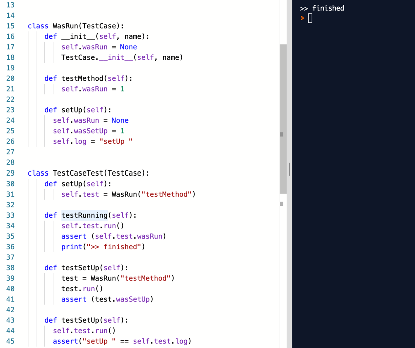
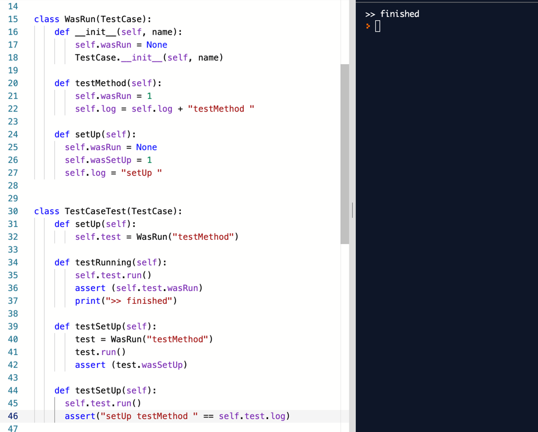
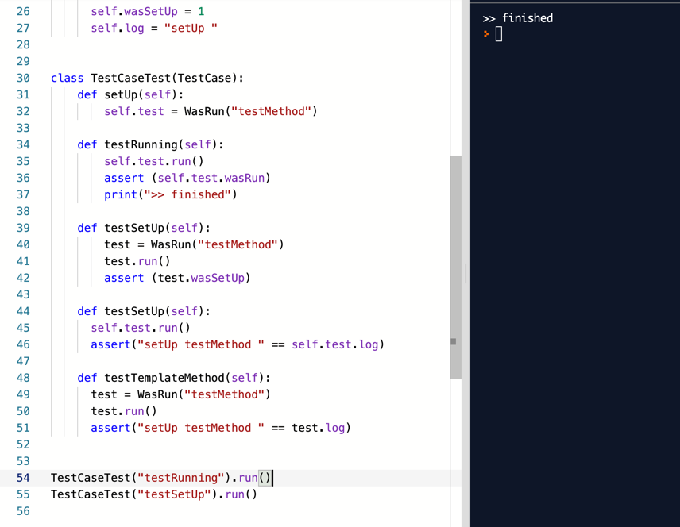
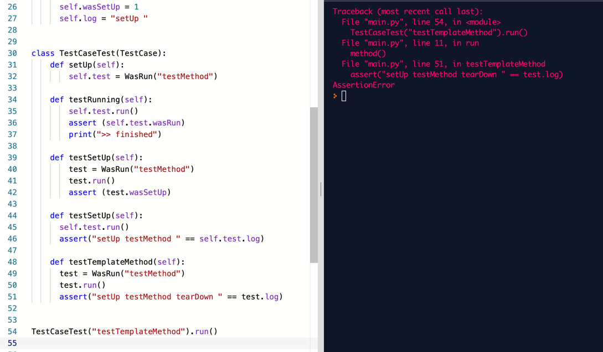
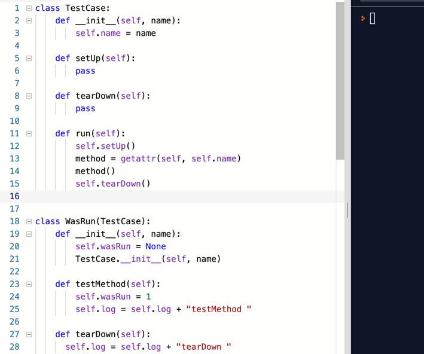
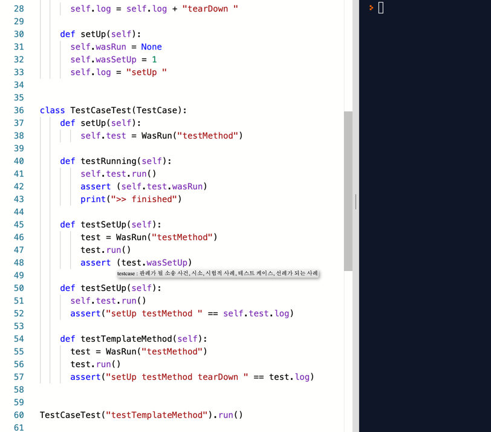

# 뒷정리하기

- [X] 테스트 메서드 호출하기
- [X] 먼저 setUp 호출하기
- [ ] **나중에 tearDown 호출하기**
- [ ] 테스트 메서드가 실패하더라도 tearDown 호출하기
- [ ] 여러 개의 테스트 실행하기
- [ ] 수집된 결과를 출력하기 

이렇게 하려고 보니, 로그를 남기는게 좋겠어요.

- [X] 테스트 메서드 호출하기
- [X] 먼저 setUp 호출하기
- [ ] 나중에 tearDown 호출하기
- [ ] 테스트 메서드가 실패하더라도 tearDown 호출하기
- [ ] 여러 개의 테스트 실행하기
- [ ] 수집된 결과를 출력하기 
- [ ] **WasRun 에 로그 문자열 남기기**

  

조금 더 나가봐요.

  

역시 빨간줄 없이 진행되네요.

  

여기까지 했으니까 다시,

- [X] ~~테스트 메서드 호출하기~~
- [X] ~~먼저 setUp 호출하기~~
- [ ] **나중에 tearDown 호출하기**
- [ ] 테스트 메서드가 실패하더라도 tearDown 호출하기
- [ ] 여러 개의 테스트 실행하기
- [ ] 수집된 결과를 출력하기 
- [X] ~~WasRun 에 로그 문자열 남기기~~

`tearDown` 로그를 추가하고 실행하면, 당연히 실패.
  

그래서, 수정하면.  
  
  

- [X] ~~테스트 메서드 호출하기~~
- [X] ~~먼저 setUp 호출하기~~
- [X] ~~나중에 tearDown 호출하기~~
- [ ] 테스트 메서드가 실패하더라도 tearDown 호출하기
- [ ] 여러 개의 테스트 실행하기
- [ ] 수집된 결과를 출력하기 
- [X] ~~WasRun 에 로그 문자열 남기기~~
