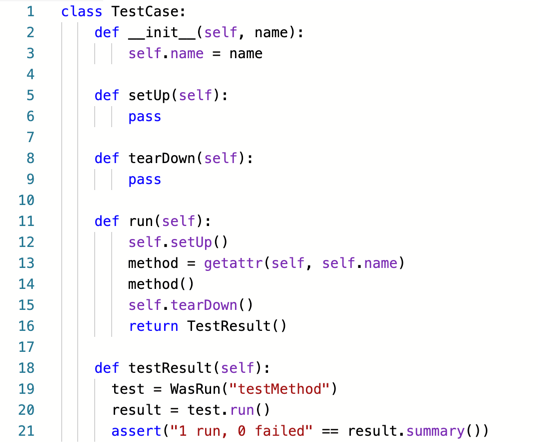
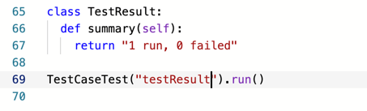
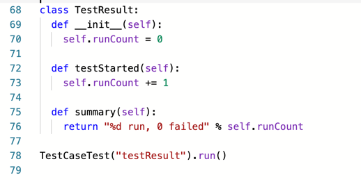
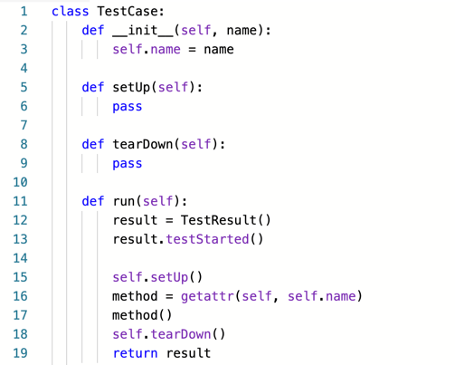
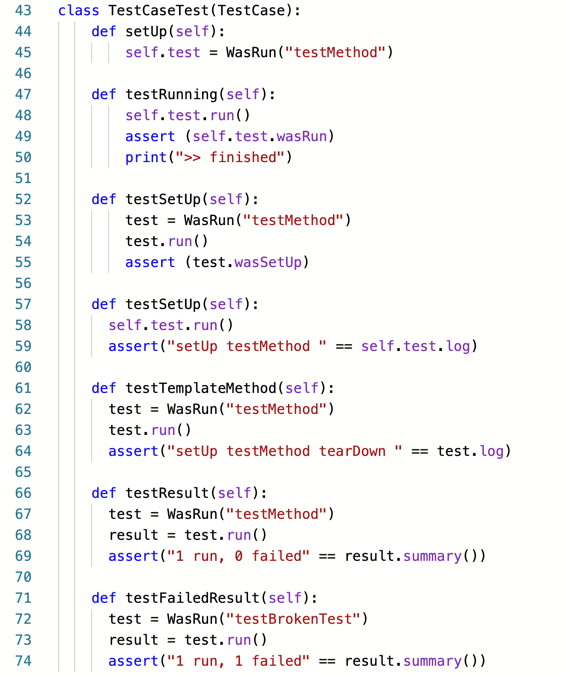
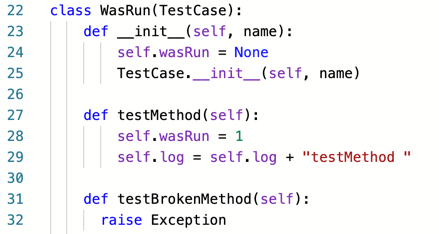

# 셈하기

- [X] ~~테스트 메서드 호출하기~~
- [X] ~~먼저 setUp 호출하기~~
- [X] ~~나중에 tearDown 호출하기~~
- [ ] 테스트 메서드가 실패하더라도 tearDown 호출하기
- [ ] 여러 개의 테스트 실행하기
- [ ] **수집된 결과를 출력하기** 
- [X] ~~WasRun 에 로그 문자열 남기기~~

시작해 볼까요?  

  
결과를 출력하고 싶은 형식으로 `class TestCase` 를 하나 만들었고,

  
이렇게 해서 `def run(self)` 메서드에 `return TestResult()` 라고 해주고,

  
실행.

스텁으로 만든 `def summary(self)` 를 구체적으로 구현 해줘야 겠네요.
  
`System.out.printf(...)` (또는 `String.format(...)`) 같은 문법이군요. 문자열 결합하는 것보다 저런게 훨씬 좋아보여요.

  
이렇게 해서 실행, 성공!

이제 깨지는 테스트를 만들어야 겠네요.

  
`def testFailedResult(self)` 를 만들어서 실패할 때 결과를 어떻게 하고 싶은지 해놓고,

  
`raise Exception` 으로 예외를 던지며.. 끝?!  
당황스럽게도 이래놓고선 챕터를 마감하다니...

- [X] ~~테스트 메서드 호출하기~~
- [X] ~~먼저 setUp 호출하기~~
- [X] ~~나중에 tearDown 호출하기~~
- [ ] 테스트 메서드가 실패하더라도 tearDown 호출하기
- [ ] 여러 개의 테스트 실행하기
- [X] ~~수집된 결과를 출력하기~~ 
- [X] ~~WasRun 에 로그 문자열 남기기~~
- [ ] 실패한 테스트 보고하기

