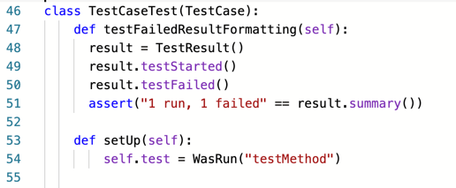
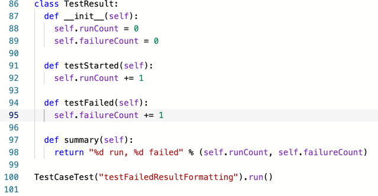
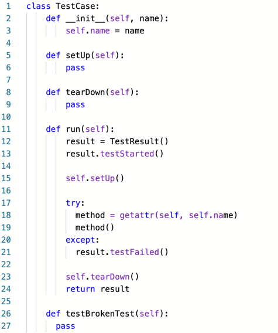

# 실패처리하기

- [X] ~~테스트 메서드 호출하기~~
- [X] ~~먼저 setUp 호출하기~~
- [X] ~~나중에 tearDown 호출하기~~
- [ ] 테스트 메서드가 실패하더라도 tearDown 호출하기
- [ ] 여러 개의 테스트 실행하기
- [X] ~~수집된 결과를 출력하기~~ 
- [X] ~~WasRun 에 로그 문자열 남기기~~
- [ ] **실패한 테스트 보고하기**

지난번에 만들다만 놈으로 확인을 해보면
```
Traceback (most recent call last):
  File "main.py", line 90, in <module>
    TestCaseTest("testFailedResult").run()
  File "main.py", line 17, in run
    method()
  File "main.py", line 77, in testFailedResult
    assert("1 run, 1 failed" == result.summary())
AssertionError
```
`AssertionError` 를 만나게 됐는데, 이게 올바른 결과를 출력한건지 어쩐건지 싶으니깐 그걸 먼저 테스트 해봐요.

    
억지로 실패를 해보는 거죠.

  
 음~ 잘되네요. 이제 예외를 찾아서 `testFiled()` 를 호출하게 해주면 되겠어요.
 
   
 `try ~ except` 문법이 더 자연스러운 것 같네요. 물론 자바는 `catch` 하면서 파라미터로 `Exception` 을 선언하니까 그것대로 괜찮긴 하지만요.
 
 어쨌든 성공해요. 그런데, `setUp(self)` 에서 예외가 발생하면 멈춰버리는 경우가 생기는 군요.  
 
 
- [X] ~~테스트 메서드 호출하기~~
- [X] ~~먼저 setUp 호출하기~~
- [X] ~~나중에 tearDown 호출하기~~
- [ ] 테스트 메서드가 실패하더라도 tearDown 호출하기
- [ ] 여러 개의 테스트 실행하기
- [X] ~~수집된 결과를 출력하기~~ 
- [X] ~~WasRun 에 로그 문자열 남기기~~
- [X] ~~실패한 테스트 보고하기~~
- [ ] setUp 에러를 잡아서 보고하기

