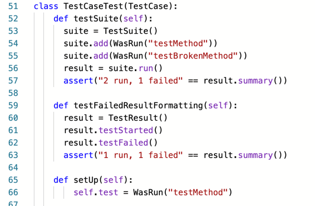
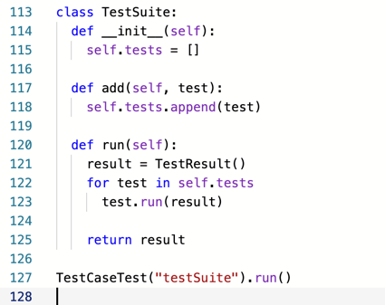

# 얼마나 달콤한지 (How Suite It Is: Suite ≓ Sweet)

- [X] ~~테스트 메서드 호출하기~~
- [X] ~~먼저 setUp 호출하기~~
- [X] ~~나중에 tearDown 호출하기~~
- [ ] 테스트 메서드가 실패하더라도 tearDown 호출하기
- [ ] **여러 개의 테스트 실행하기**
- [X] ~~수집된 결과를 출력하기~~ 
- [X] ~~WasRun 에 로그 문자열 남기기~~
- [X] ~~실패한 테스트 보고하기~~
- [ ] setUp 에러를 잡아서 보고하기

중복은 언제나 나쁘대요. 맞아요. 그런것 같아요. 근데, 중복제거가 진짜 귀찮은 것 같아요. 리팩토링이라는 거창하고 우아한 이름을 달아 놨지만... 사실상 개발하면서 뻔지 중복인 줄 알면서도 조금 더 생각해야하고 조금 더 궁리해야 하는 번거로움을 애써 외면하다보니까 계속 악취를 품은 코드를 만들어 내는 것 같아요. 현실적으로도  미션 대비 주어진 촉박한 시간 비율이 면죄부를 주지만, 결과적으로 좌절감이나 실망감, 자기비하, 박탈감 등은 어쨋거나 스스로 감당해야할 부채, 짐, 로스... 뭐, 그런거 같아요. 갑자기 신세한탄 뭐임(??).

모든 테스트 결과를 찍어내야 하겠네요.  
  
`def testSuite(self)` 를 만들어서 테스트가 이렇게 실행되길 바라고,

  
`class TestSuite` 드디어 테스트 슈트를 만들었네요. (개인적으로 suite 를 슈ː트 라고 발음하는게 편한데, 잘못된 발음인가요?)  
~~오타 있는데 캡쳐니까, 그냥 넘어 갈게요~~

성공하고 이제 실제로 모든 메서드들을 넣어 볼게요.  
어라 망함...

이게 코드가 더 실행이 안되네요. ㅜㅠ 뭐지...
모르겠다...

